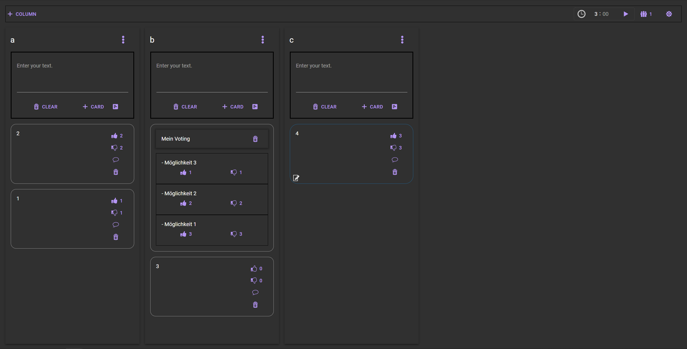

# ScrumTool


### Getting Started
Just download the latest app (via releases) and start it via <br>
```
java -jar ScrumTool-VERSION.jar
```

## Wiki
https://github.com/fo0/ScrumTool/wiki

## Releases
Latest Stable: https://github.com/fo0/ScrumTool/releases/tag/v0.10 


## info for devs
add property `app.debug=true` to your i.e. eclipse run-configuration via `Override Properties` to see more informations

## interact with the database
You can easy read the h2-database file which is default located in the same directory like your `ScrumTool-VERSION.jar`
To access the file you just need to download the latest h2 client from the official site: https://h2database.com/h2-2019-10-14.zip
Unzip the .zip and use the client `h2-VERSION-.jar` from the `bin` directory.

### The command to show the tables is i.e. 
``` sql
java -cp h2*.jar org.h2.tools.Shell -url jdbc:h2:file:./database -user sa -password sa -sql "show tables"
```

### To print all Boards just execute the following statement
``` sql
java -cp h2*.jar org.h2.tools.Shell -url jdbc:h2:file:./database -user sa -password sa -sql "show * from tkbdata"
```

### To empty the entire database (maybe outdated, check the tables), you can use the following command
```sql
java -cp h2*.jar org.h2.tools.Shell -url jdbc:h2:file:./database -user sa -password sa -sql \
"SET REFERENTIAL_INTEGRITY FALSE;\
truncate table tkbdata;\
truncate table tkboptions;\
truncate table tkbcolumn;\
truncate table tkbcard;\
truncate table tkbcardlikes;\
truncate table tkbcardcomment;"
```

### truncate all data at midnight
Just create an entry in your crontab.
This deletes all the data at midnight 0:00
```cron
0 0     * * *   root    sh /root/empty_database.sh
```
